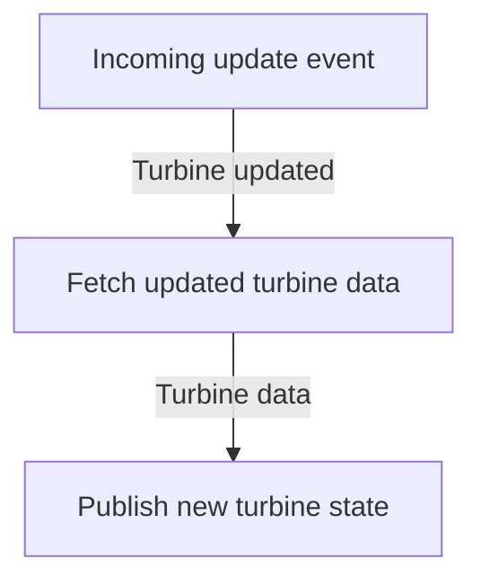

# QA engineer challenge

## Objectives

In this repository you will find a typical microservice.
The typical data flow of the app looks like so:

 
Currently there are no tests in place.
Make sure that the described data flow actually works and fix probably existing bugs.
The methodology is totally up to you, if you would like to use test containers, integration tests with mocks or any other solution is absolutely fine.
The only requirement is that the tests can be executed automatically as part of a CI pipeline. 

## Technical details

### RabbitMQ setup

To connect to RabbitMQ configure:

- `RabbitMQ:Connections:Default:HostName`
- `RabbitMQ:Connections:Default:Username`
- `RabbitMQ:Connections:Default:Password`

Queues and bindings will be created automatically (if necessary).
Inputs & outputs are defined in the [api/events.yaml](api/events.yaml) (based on [AsyncAPI](https://www.asyncapi.com)).

### Master data API

The base URI for the master data API will be loaded from the config via:

- `MasterData:BaseUri`

The client is auto-generated from the OpenAPI spec ([api/master-data.yaml](api/master-data.yaml)).
